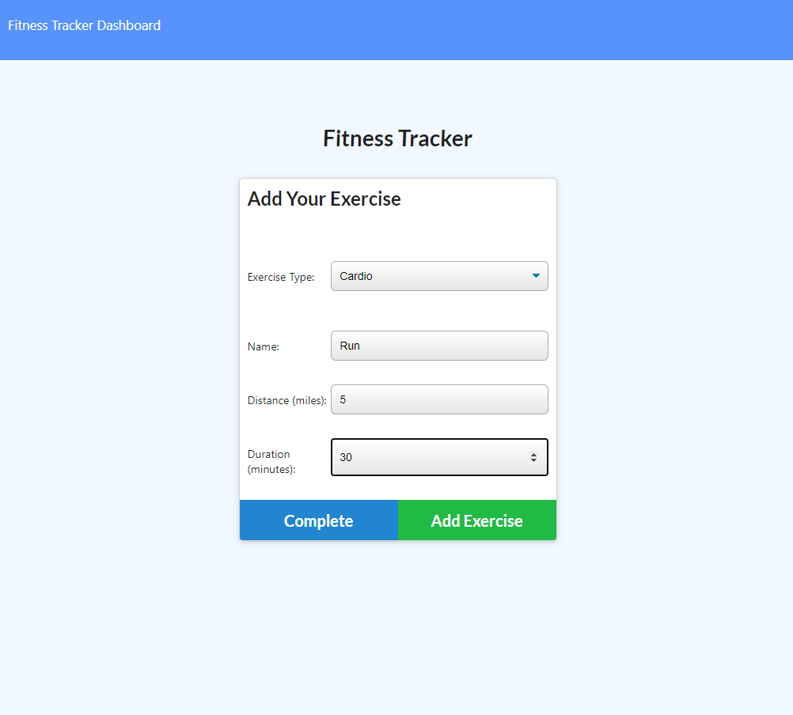

# Fitness-Tracker-DB

Fitness Tracker app built using MongoDB.

## Description 

* [Github Repository](https://github.com/kirsralk/Fitness-Tracker-DB).
* [Deployed on Heroku](https://shrouded-harbor-54035.herokuapp.com/).

Fitness Tracker allows users to create a Workout and then add exercises to that workout.  Cumulative workout stats are displayed on the Dashboard.

* App Screenshot:



### User Story

```
As a user,
I  want to be able to view create and track daily workouts. 
I want to be able to log multiple exercises in a workout on a given day. 
I should also be able to track the name, type, weight, sets, reps, and duration of exercise. 
If the exercise is a cardio exercise, I should be able to track my distance traveled.
```

## Installation

This app is deployed on Heroku and can be accessed from your browser at https://shrouded-harbor-54035.herokuapp.com/.

## Credits

Created by Kirsi: https://github.com/kirsralk/


## License

[](https://opensource.org/licenses/MIT)